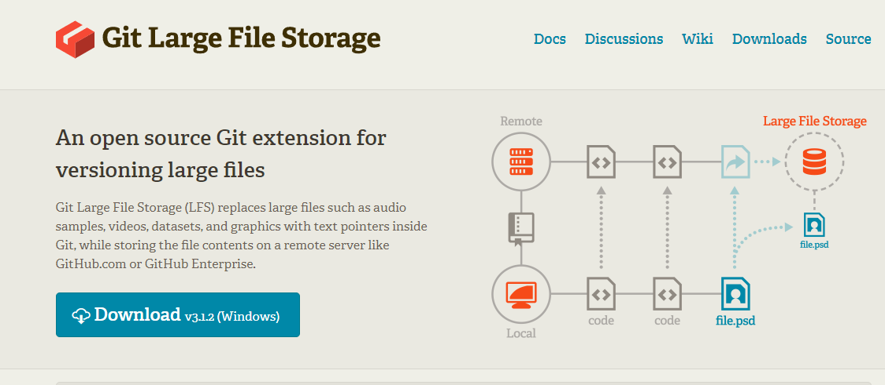
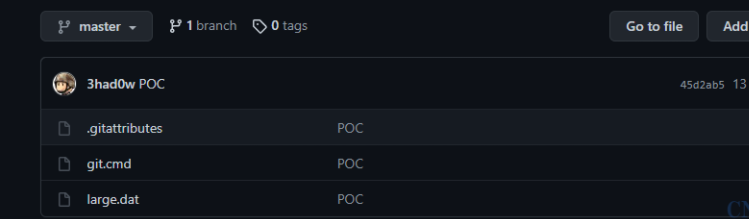
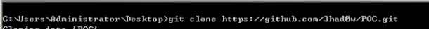
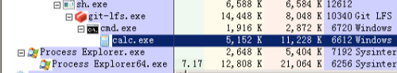
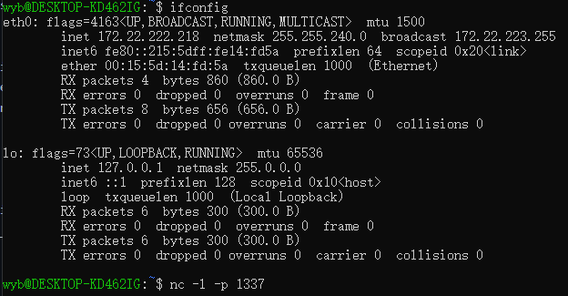
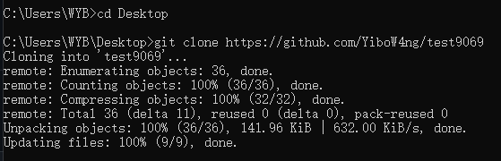
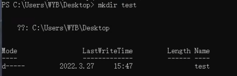

CVE-2020-27955
Git-LFS Remote Code Execution Vulnerability
==============

[Git LFS](https://git-lfs.github.com/) is a Git extension developed by Github to implement Git‘s support for large files. Remote code execution issue found on Git-LFS versions <= 2.12 on Windows platforms.

Git LFS vulnerability allows attackers to compromise targets’ Windows systems
It allows attackers to achieve remote code execution if the Windows-using victim is tricked into cloning the attacker’s malicious repository using a vulnerable Git version control tool.

### How does this work
Once victim clone malicious repository and runs vulnerable Git-LFS version on their system.These automatically executed codes may be Trojans.

### Who uses 
* Attackers
* Teachers
* Microsoft
* Linux
* Git
* ...

### Why is useful
It can prevent attackers from using this vulnerability to download all contents in Git folder. If there is sensitive information in the folder, such as site source code, database account password, etc., the attacker may directly control the server.

### What is the real-world impact
A vulnerability crisis triggered by git will affect all developers in the community. When users operate in malicious code base, they may be attacked by arbitrary code execution. The remote code repository contains sub module definitions and data, which are bundled together as folders and submitted to the parent code repository. When the code warehouse is copied back and forth, GIT will initially put the parent warehouse in the working directory and then prepare to copy the sub module.

However, GIT will later find that it does not need to copy the sub module, because the sub module has been submitted to the parent repository, it is also written to the working directory, and the sub module already exists on disk. Therefore, GIT can skip the step of grabbing files and use sub modules directly in the working directory on disk.

It is the sub module configuration vulnerability that makes this error, so git sets the vulnerability by the sub module. The child module repository is submitted to the parent repository and has never been physically copied. There may be configured hooks in the sub module repository. When the user reappears, the malicious parent library will be carefully designed. Write to the working directory, then git reads the sub modules, writes them to the working directory, and finally executes any post checkout hook in the sub module repository.

Demo/How to run this Demo
----
Step1:Open a Linux Virtual Machine and use ifconfig to find your ip address,then modify the ip address in file revsh_powersh.ps1, then in linux, listen to port 1337(which defind in file revsh_powersh.ps1) by using command nc -l -p 1337

Step2:Open a cmd in windows and use git to clone the repository

Step3:At this time,the linux virtual mcahine already get control the windows, we can run some malicious code on linux, such as mkdir test or start calc to test the bug

Citations
---------
* https://git-lfs.github.com/
* https://github.com/DeeLMind/CVE-2020-27955-LFS
